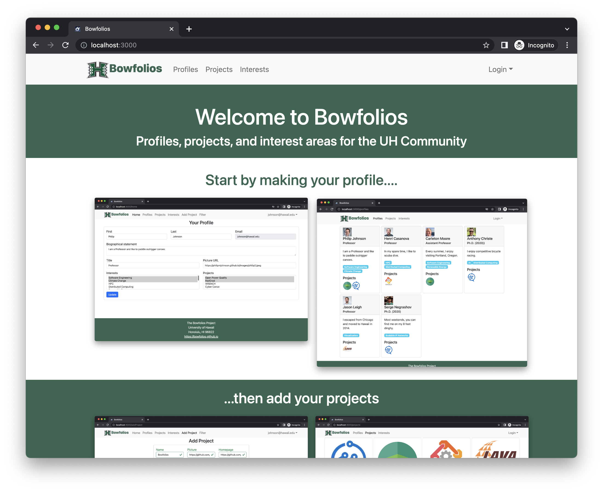
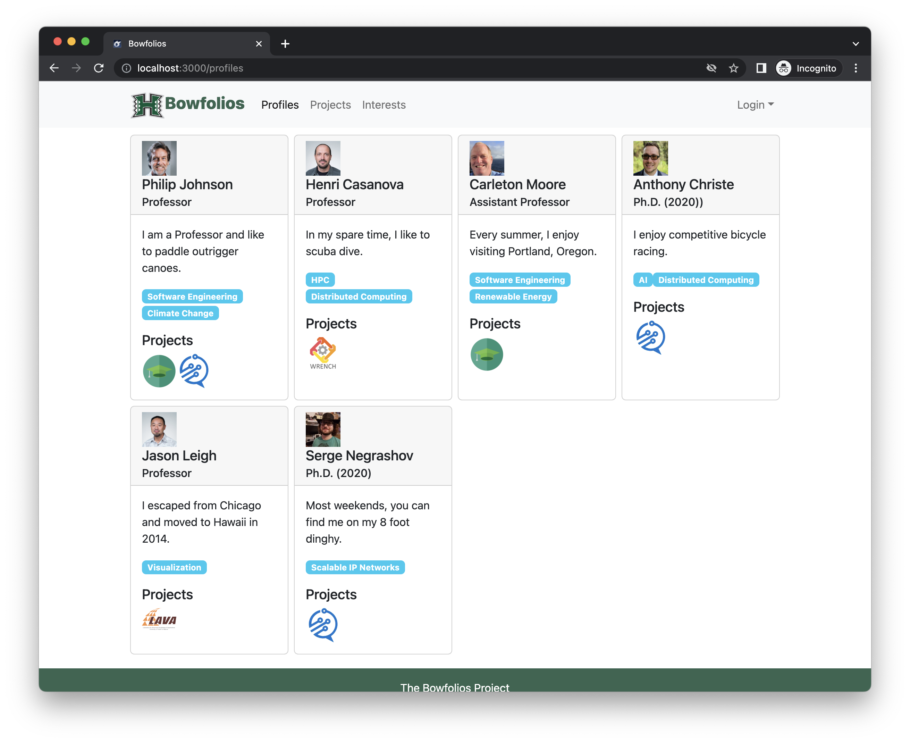
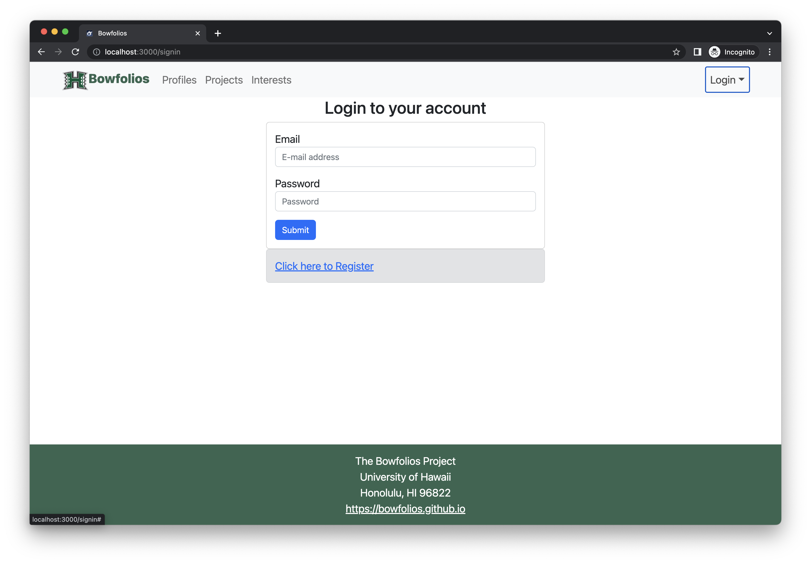
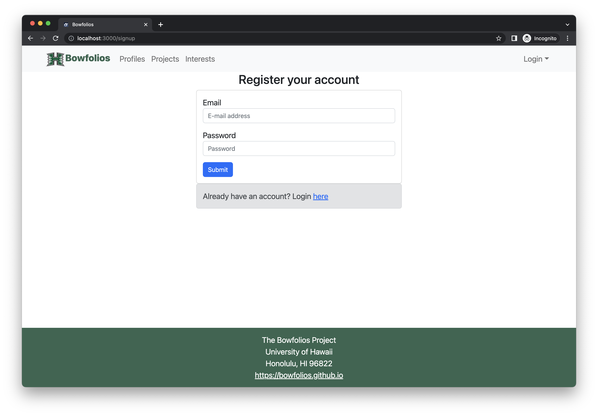
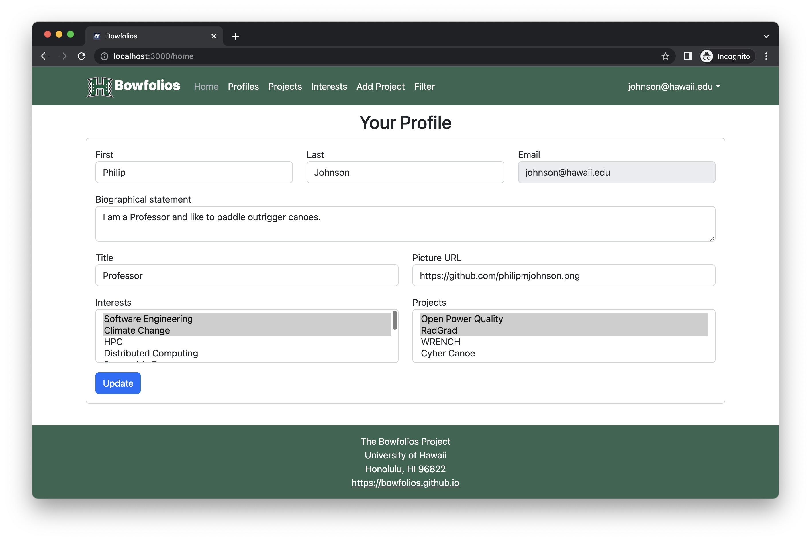
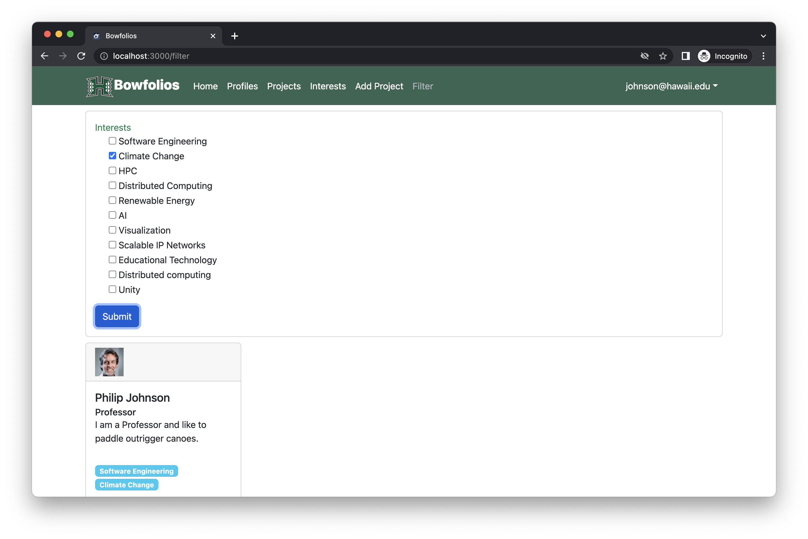
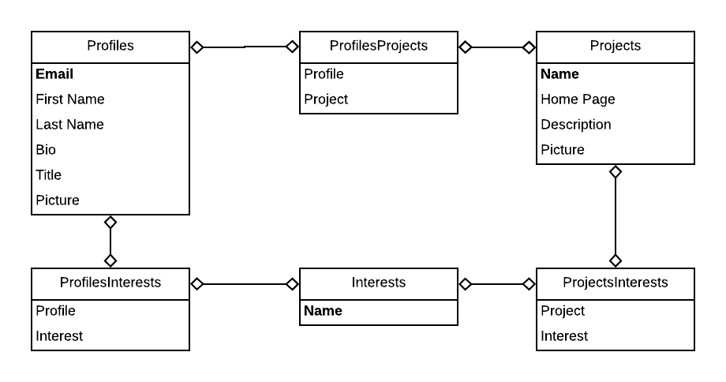
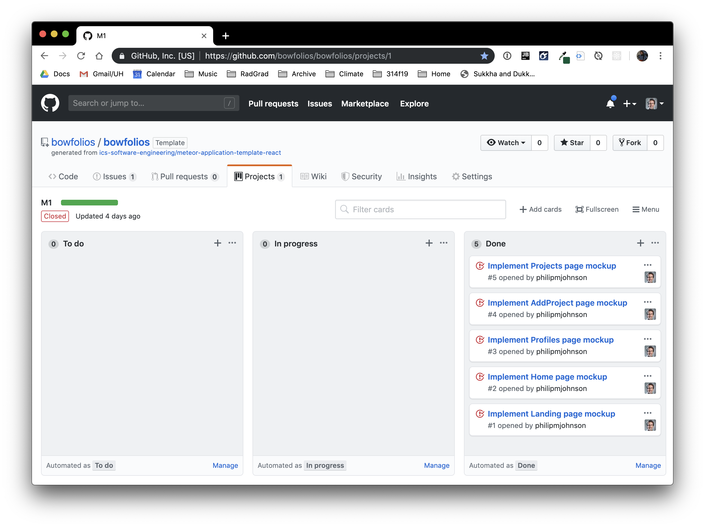
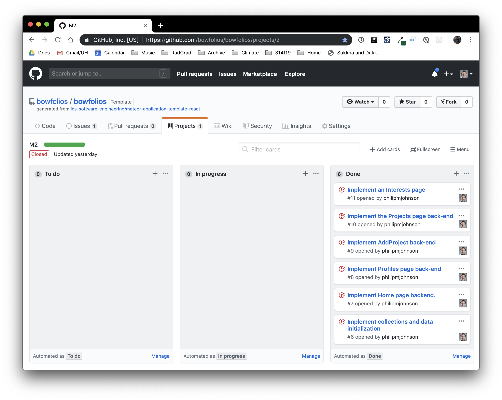
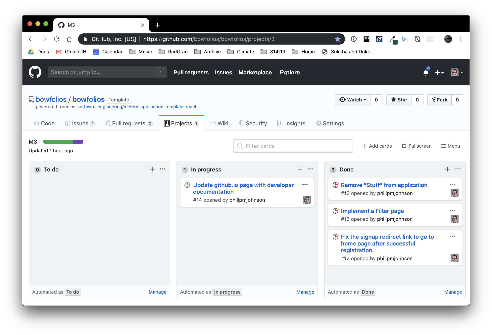

## Table of contents

* [Overview](#overview)
* [User Guide](#user-guide)
* [Community Feedback](#community-feedback)
* [Developer Guide](#developer-guide)
* [Development History](#development-history)
* [Walkthrough videos](#walkthrough-videos)

## Overview 

BowFolios is an example Meteor 1.8 application that provides pages to view and (in some cases) modify profiles, projects, and interests. It is designed to provide executable code implementing several useful design concepts for ICS software engineering students, including:

* React for component-based UI implemetation and React Router for routing.
* Semantic UI CSS Framework for UI design.
* Uniforms for form design and display.
* Three primary collections (Profiles, Projects, Interests) as well as three "join" Collections (ProfilesInterests, ProfilesProjects, and ProjectsInterests) that implement many-to-many relationships between them.
* Top-level index pages (Profiles, Interests, and Projects) that show how to manipulate these six collections in various ways.
* Initialization code to define default Profiles, Interests, and Projects and relations between them.
* A simple Filter page to illustrate how to perform simple queries on the database and display the results.  
* Use of Meteor Methods to illustrate how to simplify implementation of multiple collection updates.
* Use of indexes to enforce uniqueness of certain fields in the collections, making them primary keys.  
* Certain pages are public (Profiles, Projects, Interests), while other pages require login (AddProject, Filter).

## User Guide

This section provides a walkthrough of the Bowfolios user interface and its capabilities. 

### Landing Page

The landing page is presented to users when they visit the top-level URL to the site. 



### Index pages (Projects, Profiles, Interests)

Bowfolios provides three public pages that present the contents of the database organized in various ways. 

The Profiles page shows all the current defined profiles and their associated Projects and Interests:



The Projects page shows all of the currently defined Projects and their associated Profiles and Interests:


Finally, the Interests page shows all the currently defined Interests, and their associated Profiles and Projects:


### Sign in and sign up

Click on the "Login" button in the upper right corner of the navbar, then select Sign in to go to this page and login if you have previously registered an account with the system:
 

  
Alternatively, you can use this page to create a new account and sign in:



### Home page
  
After logging in, you are taken to the home page, which presents a form where you can complete and/or update your personal profile:



### Filter page

The Filter page provides the ability to query the database and display the results in the page. In this case, the query is 
to display all of the Profiles that match one or more of the specified Interest(s).



## Community Feedback 

(Not yet available.)

## Developer Guide

This section provides information of interest to Meteor developers wishing to use this code base as a basis for their own development tasks. 

### Installation

First, [install Meteor](https://www.meteor.com/install).

Second, visit the [Bowfolios application github page](https://github.com/bowfolios/bowfolios), and click the "Use this template" button to create your own repository initialized with a copy of this application. Alternatively, you can download the sources as a zip file or make a fork of the repo.  However you do it, download a copy of the repo to your local computer.
  
Third, cd into the bowfolios/app directory and install libraries with:

```
$ meteor npm install
```

Fourth, run the system with:

```
$ meteor npm run start
```

If all goes well, the application will appear at [http://localhost:3000](http://localhost:3000). 

### Application Design

Bowfolios is based upon [meteor-application-template-react](https://ics-software-engineering.github.io/meteor-application-template-react/) and [meteor-example-form-react](https://ics-software-engineering.github.io/meteor-example-form-react/). Please use the videos and documentation at those sites to better acquaint yourself with the basic application design and form processing in Bowfolios.

### Data model

As noted above, the Bowfolios data model consists of three "primary" collections (Projects, Profiles, and Interests), as well as three "join" Collections (ProfilesProjects, ProfilesInterests, and ProjectsInterests).  To understand this design choice, consider the situation where you want to specify the projects associated with a Profile. 

Design choice #1: Provide a field in Profile collection called "Projects", and fill it with an array of project names. This choice works great when you want to display a Profile and indicate the Projects it's associated with.  But what if you want to go the other direction: display a Project and all of the Profiles associated with it?  Then you have to do a sequential search through all of the Profiles, then do a sequential search through that array field looking for a match.  That's computationally expensive and also just silly.

Design choice #2:  Provide a "join" collection where each document contains two fields: Profile name and Project name. Each entry indicates that there is a relationship between those two entities. Now, to find all the Projects associated with a Profile, just search this collection for all the documents that match the Profile, then extract the Project field. Going the other way is just as easy: to find all the Profiles associated with a Project, just search the collection for all documents matching the Project, then extract the Profile field. 

Bowfolios implements Design choice #2 to provide pair-wise relations between all three of its primary collections:




## Initialization

The [config](https://github.com/bowfolios/bowfolios/tree/master/config) directory is intended to hold settings files.  The repository contains one file: [config/settings.development.json](https://github.com/bowfolios/bowfolios/blob/master/config/settings.development.json).

This file contains default definitions for Profiles, Projects, and Interests and the relationships between them. Consult the walkthrough video for more details. 


## Quality Assurance

### ESLint

BowFolios includes a [.eslintrc](https://github.com/bowfolios/bowfolios/blob/master/app/.eslintrc) file to define the coding style adhered to in this application. You can invoke ESLint from the command line as follows:

```
meteor npm run lint
```

ESLint should run without generating any errors.  

It's significantly easier to do development with ESLint integrated directly into your IDE (such as IntelliJ).

### From mockup to production

Bowfolios is meant to illustrate the use of Meteor for developing an initial proof-of-concept prototype.  For a production application, several additional security-related changes must be implemented:

* Use of email-based password specification for users, and/or use of an alternative authentication mechanism.
* Use of https so that passwords are sent in encrypted format.
* Removal of the insecure package, and the addition of Meteor Methods to replace client-side DB updates. 

(Note that these changes do not need to be implemented for ICS 314, although they are relatively straightforward to accomplish.)

## Development History

The development process for BowFolios conformed to [Issue Driven Project Management](http://courses.ics.hawaii.edu/ics314f19/modules/project-management/) practices. In a nutshell:
 
* Development consists of a sequence of Milestones. 
* Each Milestone is specified as a set of tasks.  
* Each task is described using a GitHub Issue, and is assigned to a single developer to complete. 
* Tasks should typically consist of work that can be completed in 2-4 days.  
* The work for each task is accomplished with a git branch named "issue-XX", where XX is replaced by the issue number. 
* When a task is complete, its corresponding issue is closed and its corresponding git branch is merged into master. 
* The state (todo, in progress, complete) of each task for a milestone is managed using a GitHub Project Board.

The following sections document the development history of BowFolios.

### Milestone 1: Mockup development

The goal of Milestone 1 was to create a set of HTML pages providing a mockup of the pages in the system. 

Milestone 1 was managed using [BowFolio GitHub Project Board M1](https://github.com/bowfolios/bowfolios/projects/1):



### Milestone 2: Data model development 

The goal of Milestone 2 was to implement the data model: the underlying set of Mongo Collections and the operations upon them that would support the BowFolio application.

Milestone 2 was managed using [BowFolio GitHub Project Board M2](https://github.com/bowfolios/bowfolios/projects/2):



## Milestone 3: Final touches

The goal of Milestone 3 was to clean up the code base and fix minor UI issues.

Milestone 3 was managed using [BowFolio GitHub Project Board M3](https://github.com/bowfolios/bowfolios/projects/3):



As of the time of writing, this screenshot shows that there is an ongoing task (i.e. this writing).

# Walkthrough videos

BowFolios is intended as a model of how an ICS 314 project could be organized and executed. Here are some videos to walk through various aspects of the system and development process:

* [BowFolios: User Interface](https://www.youtube.com/watch?v=aZvxRQfQdkE)
* [BowFolios: Development Process](https://www.youtube.com/watch?v=8pTgFtbcjTc)
* [BowFolios: Application Structure](https://www.youtube.com/watch?v=_5g5CzZ0Toc)
* [BowFolios: Authentication and Authorization](https://www.youtube.com/watch?v=AaXShN8cYNY)
* [BowFolios: Initialization](https://www.youtube.com/watch?v=P3Kigb1gtVo)
* [BowFolios: Unit Testing](https://www.youtube.com/watch?v=EexZfw1yMJs)
* [BowFolios: Design Patterns](https://www.youtube.com/watch?v=yP-t44HBCPQ). Maybe watch [this](https://www.youtube.com/watch?v=Z2yjimK_MJU) first.


